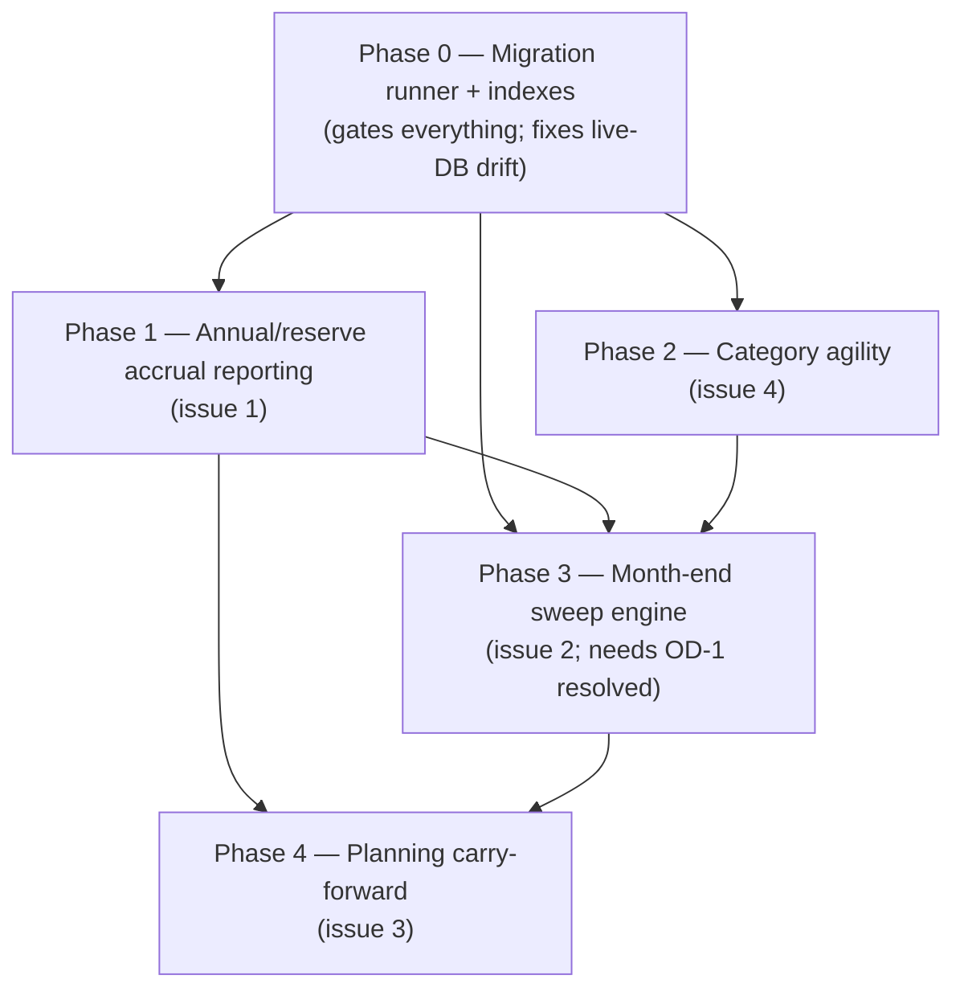

# Budgeting App — Design Review & Implementation Plan

**Date:** 2026-09-27
**Stack (fixed by `AGENTS.md`):** FastAPI + raw `sqlite3` (no ORM), React 19 + TS + Vite, CSS Modules, react-query, pywebview desktop wrapper.
**Scope:** three design issues (annual budget items, month-end goal sweeps, budget updates) + schema assessment for monthly vs annual items + category agility.

---

## 1. Findings that shaped this plan

These were verified against the source and the live database, not inferred.

| # | Finding | Evidence |
|---|---|---|
| F1 | **The live DB has drifted from the code.** `data/budget.db` is on the pre-migration-001 schema: `PRAGMA user_version = 0`, no `expenses.goal_id` column, no `sweep_rules`, no `closed_months`. | `sqlite3 data/budget.db ".schema"` |
| F2 | **`init_db()` cannot fix that.** It runs on every startup, but `CREATE TABLE IF NOT EXISTS expenses (...)` silently skips an existing table, so the `goal_id` *column* can never appear. `sweep_rules`/`closed_months` are new tables and *will* appear on next boot, but the live DB predates the current code. | `backend/database.py:48-122`, `backend/main.py:23-27` |
| F3 | **`schema_migrate_001.py` is never invoked by the app.** Nothing imports it; it is a manual `__main__` script. | `grep -rn "schema_migrate"` → only the file itself + its test |
| F4 | **`goal_id` is declared but never queried.** No router reads `expenses.goal_id`; goal progress is computed by string-matching `goal_budget_links` against expense `category`/`subcategory`. | `grep -rn "goal_id" backend/routers/` → only `/{goal_id}` path params |
| F5 | **`frequency` conflates cadence with comparison basis.** `/reporting/summary` pro-rates an annual limit by `/12` and compares it to one month's spend. | `backend/routers/reporting.py:41-43, 73-93` |
| F6 | **`_monthly_equivalent` and the status thresholds are duplicated 4×** — two backend copies, two frontend copies. | `reporting.py:41`, `budgets.py:56`, `Dashboard.tsx:20-27`, `Planning.tsx:23-30` |
| F7 | **`GET /api/budget-drafts/{month}` writes to the DB.** If the month has no drafts it inserts rows copied from active budgets. | `backend/routers/budget_drafts.py:48-71` |
| F8 | **Committing a month silently rewrites every future month.** Changes cascade to all future draft months; removed categories are deleted from future drafts. | `backend/routers/budget_drafts.py:177-183, 217-221` |
| F9 | **The category list is sourced from expense history, not the budget.** Importer auto-classification fuzzy-matches against `SELECT DISTINCT description, category, subcategory FROM expenses`. | `backend/routers/import_csv.py:213-233` |
| F10 | **Goal semantics are inconsistent across three places.** Live UI = category-*spend* total; original R CSV = per-month savings *boolean*; the requested sweep = money *moved into* the goal. | `Goals.tsx:132-141`, `data/goal_progress.csv`, issue #2 |

**Root framing:** issues 1 and 2 are the same missing piece — no record of money crossing period boundaries. Issue 3 is a planning-lifecycle/UX problem, not a schema problem. Issue 4 (category agility) is a data-model problem.

---

## 2. Decisions locked from your answers

| Topic | Decision |
|---|---|
| **Leftover definition** | Sum of unspent envelopes (budgeted − spent), overspend in one category offsets underspend in another. *(Not* floored at zero per category.)* |
| **Annual item reporting** | YTD accrual comparison — cumulative spend vs accrued-to-date, surfaced as a running fund balance. **No schema change to `budgets`.** |
| **Planning UX** | Carry-forward is **invisible**; no "reuse or modify?" prompt. Editing a future month transparently splits the effective-dated row. |
| **Goal model** | Savings envelope (see §3, Open Decision OD-1 — recommended, treated as an assumption). |
| **Priority for categories** | Freedom to add/remove categories each month; categories read reactively from the *current budget*; legacy categories hidden. |

**Pushback acknowledged:** your reading of the `budgets` effective/conclusion model is right and better than my initial proposal — per-line effective-dating removes the need for a `cadence_month` column, and it dissolves the cascade problem (F8) rather than patching it. I've adopted it in Phase 4.

**Reversal to confirm:** your original note asked the app to *ask* "reuse last month / modify?" at turnover; you've since said it should happen invisibly. This plan follows the invisible version and downgrades the prompt to a non-blocking dashboard notice.

---

## 3. Open decisions

These are the places the plan makes a call that you could reasonably reverse. Each is marked where it lands in the phases.

- **OD-1 — Goal model (blocks Phase 3).** *Recommended: savings envelope.* A goal's balance = `SUM` of contributions tagged `goal_id` (manual + sweep). This is the only model consistent with "leftover money funnels into goals." The existing category-link behavior (`goal_budget_links` → sum of spend in a linked *spending* category, plus a synthetic budget row) would be retired. *Alternative:* keep category-linking as a separate "category target" goal type. Everything downstream assumes the envelope model.
- **OD-2 — Accrual window (Phase 1).** *Recommended: months elapsed since the budget row's `effective_date`, capped at the cadence length* (12 / 6 / 3). Alternative: calendar year (Jan–Dec), which is more intuitive for a single annual item but doesn't generalize to quarterly/bi-annual.
- **OD-3 — Mid-year edits to a reserve (Phase 1/4).** Editing an annual item's amount concludes the old row and inserts a new one with a **new `effective_date`**, which resets the accrual clock and would wipe the accrued balance. Options: (a) add a nullable `accrual_anchor_date` to `budgets` and carry it forward on split — cleanest; (b) walk the row chain to find the earliest ancestor's `effective_date` — no schema change, more query complexity; (c) accept the reset. *Recommended: (a).* This is the one place I'd add a column to `budgets` despite your "keep the schema" preference.
- **OD-4 — Does leftover get capped at income?** With the "sum of unspent envelopes" definition, leftover can exceed actual cash surplus (unenveloped income and overspend both distort it). *Recommended: no cap, but show "unbudgeted spend" and "income vs. total envelopes" on the proposal screen so the number is auditable.*
- **OD-5 — Category strategy (Phase 2).** See §5. String keys (light) vs a `categories` dimension table (rename-safe, resolves the accrual-orphaning tension). *Recommended: start with string keys + budget-derived lists; treat the dimension table as a follow-on phase if renaming history becomes a problem.*
- **OD-6 — Is `budget_drafts` retired?** See Phase 4.

---

## 4. Cross-cutting interactions (must be handled together)

1. **Reserves must be excluded from the sweep pot.** Once annual items report on accrual, a fully-accrued-unspent reserve looks like "unspent envelope." A $2,400 travel reserve with $1,800 accrued and $0 spent must **not** contribute $1,800 to leftover. Only the period's accrual increment is already committed to the reserve. → Phase 3 leftover must exclude `frequency != 'Monthly'` lines.
2. **Goal-linked budget lines must also be excluded.** They exist (`goals.py:108-113`) and would otherwise be counted as unspent and then swept *into* the goal — double-counting.
3. **Renaming/removing a category orphans annual accrual.** Accrual needs historical spend per category; string-keyed history doesn't follow a rename. This is the direct tension between your issue-4 answer and the Phase 1 accrual math. → OD-5.
4. **Phase 0 gates everything.** Because of F1–F3, `goal_id` does not exist in your real database. Sweep work cannot land before the migration runner.
5. **Month field format is inconsistent.** `goals.target_month` / `budget_drafts.target_month` store `YYYY-MM-01`; `closed_months.month_id` stores `YYYY-MM`; `AGENTS.md` documents `YYYY-MM`. Normalize and fix the docs.

---

## 5. Phase 0 — Migration runner + schema catch-up (prerequisite)

**Goal:** make schema state deterministic and bring the live DB to the declared schema.

- New `backend/migrations/` with a `PRAGMA user_version`-keyed runner: `run_migrations(conn)` applies each version in order inside a transaction and bumps `user_version`.
- Call it from the lifespan (`backend/main.py:23-27`) after `init_db()`. This is the fix for F1–F3.
- Fold `schema_migrate_001.py`'s four steps in as **version 1** (keep the module for backwards-compat or delete it after folding). Keep `step4_backfill_goal_expenses` — but note it clears `category` on matched rows (`schema_migrate_001.py:140`), which conflicts with category-string matching still used by `Goals.tsx:132-141`. Since Phase 3 retires string matching, **either** run the backfill only after Phase 3 lands, **or** make the backfill non-destructive (stop clearing `category`). *Recommended: make it non-destructive.*
- Add indexes (currently there are none):
  - `expenses(date)`, `expenses(category, subcategory)`, `expenses(goal_id)`, `expenses(expense_type, date)`
  - `budgets(category, subcategory, effective_date)`
  - `sweep_rules(goal_id, priority_rank)`
- (OD-3a) Add nullable `budgets.accrual_anchor_date`.
- Enrich `closed_months` for auditability: `closed_at`, `leftover_amount`, `sweep_note` (or a `sweep_runs` parent). The bare `month_id` PK is too thin to re-open or explain a month.
- Update the **stale** `AGENTS.md` schema section: it omits `goal_id`/`sweep_rules`/`closed_months`, documents month fields as `YYYY-MM` when the code stores full dates, and lists default payers as "Joint, Carson, Chloe" while the importer emits "Caleb/Rae/Joint" (`import_csv.py:109-124`).
- Add `pytest` to `backend/requirements.txt` (the test suite exists but the dep isn't declared).

**Files:** `backend/migrations/*` (new), `backend/main.py`, `backend/database.py`, `backend/requirements.txt`, `.agents/workflows/AGENTS.md`.

---

## 6. Phase 1 — Annual/reserve accrual reporting (issue 1)

**Goal:** a reserve's overage stops being a monthly red flag without hiding real cash flow.

- Extract the duplicated math into one module, e.g. `backend/budget_math.py`: `monthly_equivalent()`, `accrual_window()`, `status_for()`. Import it from `reporting.py` and `budgets.py`; mirror the constants to a single frontend `web/src/lib/budgetMath.ts` so the client stops recomputing (`Dashboard.tsx:20-27`, `Planning.tsx:23-30`) — resolves F6.
- Rewrite `budget_summary` in `backend/routers/reporting.py`:
  - `frequency == 'Monthly'` → unchanged month-vs-limit comparison.
  - `frequency != 'Monthly'` → accrual basis (OD-2): `months_elapsed = clamp(months between anchor and month-end, 1, cadence_months)`; `accrued = monthly_equiv × months_elapsed`; `period_spend` = spend **within the accrual window** (not just the month); `fund_balance = accrued − period_spend`; status derived from `fund_balance` against `accrued` (reuse the 0.85 threshold semantics from `reporting.py:85-93`, but relative to `accrued`, not the month).
  - Add response fields so the UI can distinguish the two bases: `basis: "monthly" | "accrual"`, `accrued_to_date`, `period_spend`, `fund_balance`, `months_elapsed`.
- Leave `/api/reporting/trends` **as true cash flow** — the one-off spike is real and should stay. Only the comparison changes. This is the crux of issue 1.
- Frontend:
  - `Reporting.tsx` Budget Performance table: render accrual rows with a "Fund balance" column and distinct badge copy ("On pace" / "Ahead of pace" / "Reserve drawn down") rather than Over/On Track/Under.
  - `Dashboard.tsx` "Budget Health": consume the server response instead of recomputing client-side, so the two views can't disagree.
- Confirm (OD-3) how a mid-year amount change behaves so accrual doesn't reset silently.

**Files:** `backend/budget_math.py` (new), `backend/routers/reporting.py`, `backend/routers/budgets.py`, `web/src/lib/budgetMath.ts` (new), `web/src/pages/Reporting.tsx`, `web/src/pages/Dashboard.tsx`, `web/src/hooks/useReporting.ts`.

---

## 7. Phase 2 — Category agility (issue 4)

**Goal:** add/remove categories each month, read them from the current budget, hide legacy ones.

- New endpoint `GET /api/categories/active?month=YYYY-MM` returning `{category, subcategory, frequency}` from budget lines active in that month (plus that month's draft, if drafts survive Phase 4).
- Point the selection UI at it: `web/src/hooks/useExpenses.ts` `useCategories` / `useSubcategories` currently derive from expense history — change them to the active-budget source (with a month param). This is what removes legacy clutter from `Expenses.tsx`, `Planning.tsx`, and `Goals.tsx` dropdowns.
- Change `_auto_categorize` in `backend/routers/import_csv.py:213-233` to fuzzy-match against **active budget categories** rather than `DISTINCT` over `expenses`. Preserve the existing precedence rule (a category present in the bank CSV still wins, `import_csv.py:266-267`).
- In the Settings review table, offer an inline "new category" affordance that creates a budget line — so classification can introduce a category without a trip to Planning.
- (OD-5) If renames/removals must preserve historical attribution, add a `categories` dimension table (`id, name, kind, active_from, active_to`) and migrate `budgets`/`expenses` to `category_id`. Present as a separate phase; the string-key path above ships first and is reversible.

**Files:** `backend/routers/categories.py` (new) or extend `reporting.py`; `backend/routers/import_csv.py`; `web/src/hooks/useExpenses.ts`; `web/src/pages/Settings.tsx`; `web/src/api/import.ts`; `web/src/types/index.ts`.

---

## 8. Phase 3 — Month-end sweep engine (issue 2)

**Goal:** propose, then (on approval) transfer leftover into goals by priority.

- **Goal model (OD-1):** goal balance = `SUM(expenses.amount) WHERE goal_id = ?`. Retire string matching in `Goals.tsx:132-141` and `Dashboard.tsx:113-122`. Decide whether contributions are `expense_type='Goal'` rows (minimal change) or a dedicated `goal_contributions` table (cleaner separation of "savings transfer" from "spend"). *Recommended: keep `expense_type='Goal'` + `goal_id`; it reuses existing reporting filters and needs no new UI plumbing.*
- **Sweep rules CRUD** — `backend/routers/sweeps.py` (new):
  - `GET/POST/PATCH/DELETE /api/sweeps/rules` over `sweep_rules(goal_id, priority_rank, allocation_type, amount)`.
  - Validation: `allocation_type ∈ {percentage, fixed}`; percentages sum ≤ 100; `priority_rank` unique; `goal_id` must exist.
- **Proposal** — `GET /api/sweeps/proposal?month=YYYY-MM`:
  - `leftover = Σ (monthly_equiv(budget) − spent)` over **operating** envelopes only — `frequency == 'Monthly'` **and** not goal-linked (§4.1, §4.2). Negatives allowed per your decision.
  - Resolution order: apply **fixed** amounts first (in `priority_rank` order, capped by remaining pot), then distribute the remainder **proportionally** by percentage weights. Define overflow: if a goal reaches `target_amount`, remainder flows to the next priority (recommended) rather than being stranded.
  - Return per-line: goal, computed amount, current balance, projected balance, `overfunded` flag; plus a header block: income, total envelopes, total spent, unbudgeted spend, leftover (OD-4).
  - **Response is a proposal only** — no writes.
- **Approve** — `POST /api/sweeps/{month}/approve`, body = accepted lines: writes contributions, inserts/updates the `closed_months` row, returns the result. Idempotent: `409` if the month is already closed unless explicitly reopened. Reversible via reopen → delete that month's sweep-tagged contributions.
- **Frontend:**
  - Dashboard month-close modal: triggers when the previous month is absent from `closed_months`; shows leftover + proposed allocations + Approve / Adjust / Dismiss. Follows your slide-in pattern, but as a *review of a computed proposal*, not a blind mutation.
  - Settings (or a Goals sub-section): sweep-rule editor with drag-to-order priority, percentage/fixed toggle, live validation showing the resolved split.
- Reconcile with the Goals page's current "Monthly Allocation Summary" (`Goals.tsx:116-154`), which sums `expense_type='Goal'` spend — after this phase it should read goal *contributions* by `goal_id`.

**Files:** `backend/routers/sweeps.py` (new), `backend/routers/goals.py`, `backend/main.py`, `web/src/pages/Dashboard.tsx`, `web/src/pages/Goals.tsx`, `web/src/pages/Settings.tsx`, `web/src/api/sweeps.ts` (new), `web/src/hooks/useSweeps.ts` (new), `web/src/types/index.ts`.

---

## 9. Phase 4 — Planning carry-forward (issue 3)

**Goal:** zero-friction future planning; no silent rewrites; no write-on-read.

- **Remove the GET side effect (F7).** `budget_drafts.py:48-71` must not insert on read. If drafts survive, replace with an explicit `POST /api/budget-drafts/{month}/initialize`.
- **Make carry-forward invisible (your direction).** On editing a future month, split the effective-dated row: `UPDATE budgets SET conclusion_date = <month_start − 1 day> WHERE id = old` then `INSERT` a new row with `effective_date = <month_start>` (`budget_drafts.py:164-175` already does exactly this — the change is to expose it per-line on edit rather than as a whole-month commit).
- **Remove the cascade (F8).** Drop the future-draft propagation (`177-183`) and future-draft deletion (`217-221`). They are the source of the "editing one month silently changed five" fragility.
- **(OD-6) Retire `budget_drafts`?** *Recommended:* yes — edit `budgets` rows directly and let the Planning tab render the resolved active set for the target month with inline edits. This deletes an entire problem class. *Lighter alternative:* keep drafts as a scratch pad, but remove the side effect and the cascade.
- **Planning.tsx:** the month picker resolves to the active budget set for that month (read-only baseline), with inline edit that performs the split. The "Change vs. active" column (`Planning.tsx:262-288`) becomes "change vs. previous month."
- **Turnover notice, not a modal:** a non-blocking banner ("October budget active — review") rather than an interrogation, consistent with your invisible-by-default preference.
- Normalize `target_month` to `YYYY-MM` across `goals`, `budget_drafts`, `closed_months`, and the frontend normalizers (`Goals.tsx:52-63`), and fix `AGENTS.md`.

**Files:** `backend/routers/budget_drafts.py`, `backend/routers/budgets.py`, `web/src/pages/Planning.tsx`, `web/src/hooks/useBudgetDrafts.ts`, `web/src/api/budgetDrafts.ts`, `web/src/types/index.ts`.

---

## 10. Verification

- **Migration:** idempotency test (run twice, assert `user_version` and no duplicate columns); backfill test on a **copy** of `data/budget.db` (it holds 1,000 real expense rows — never mutate the original during testing). Extend `tests/test_schema_migrate_001.py`.
- **Accrual:** unit tests for `accrual_window` / `status_for` at month boundaries (Jan, mid-year, the final period month) and for a `NULL` `conclusion_date`.
- **Sweep:** tests for fixed-first-then-percentage resolution, fixed > pot, percentages not summing to 100, overfunded-goal overflow, exclude-reserves (the §4.1 guard), and approve/reopen idempotency.
- **Categories:** test that `/api/categories/active` excludes a deactivated category and that the importer no longer suggests legacy categories.
- **Frontend:** `cd web && npm run build` must pass clean (per `AGENTS.md`); manually verify Planning across three consecutive months shows independent values.
- **Backend:** exercise every changed endpoint against local uvicorn; no swallowed exceptions (`AGENTS.md`).

---

## 11. Suggested sequencing

Phase 0 is non-negotiable first. Phase 1 depends on nothing but Phase 0 and delivers issue 1 immediately. Phases 2–4 are largely independent after that, but Phase 3 needs OD-1 settled and needs Phase 1's accrual basis to compute leftover correctly.

---

## 12. Explicitly out of scope (unless you say otherwise)

- The `categories` dimension table / FK migration (OD-5) — proposed but deferred.
- Fixing the packaging mismatch (`README.md`/`AGENTS.md` claim PyInstaller; `scripts/build_mac_app.py` hand-rolls an `.app` with a hardcoded absolute project path and no `web/vite.config.ts` exists).
- Dead-code cleanup (`useReporting.useSpendingTrends`, `useSetIncome`, `Modal.tsx`, `useSuggestedBudgets` + `/api/budgets/suggested` have no UI; the WMA "Suggested Budgets" feature from `PLAN.md` was never built).
- Rolling over unspent *monthly* envelopes into the next month (a distinct feature from the month-end goal sweep — not requested).
