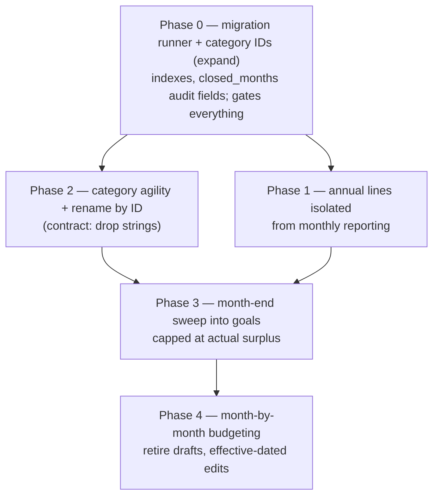

# Budgeting App — Settled Decisions & Revised Implementation Plan

**Date:** 2026-09-28
**Supersedes:** `.posit/assistant/plans/2026-09-27-1815-plan.md`
**Stack (fixed by `AGENTS.md`):** FastAPI + raw `sqlite3` (no ORM), React 19 + TS + Vite, CSS Modules, react-query, pywebview desktop wrapper.
**Scope:** annual budget lines, month-end goal sweeps, month-by-month budget editing, and category identity.

---

## 1. Corrections to the previous plan

Verified against source and the live DB during this session.

| # | Correction |
|---|---|
| C1 | **The accrual model was misattributed to you.** The previous plan's §2 ("Decisions locked from your answers") recorded "YTD accrual comparison — cumulative spend vs accrued-to-date, surfaced as a running fund balance." Nothing in the repo describes an accrual model: `PLAN.md` defines budget lines only as an "Amount per period" at a frequency, plus a derived "Monthly Equiv" column. **That row is struck, and everything derived from it is dropped** (previous OD-2, OD-3, the fund-balance reporting, and the contribution ledger). |
| C2 | **F6 was overstated.** The previous plan claimed the monthly-equivalent math *and* status thresholds were duplicated 4×. The ÷12 divisor is indeed in 4 places; the status thresholds are only in 2 (`reporting.py:86-93`, `Dashboard.tsx:87-89`). |
| C3 | **F8 needs nuance.** The commit cascade wasn't accidental — memory records it as a *fix* for "commit did not cascade to future drafts." It is still the wrong mechanism, but it existed to solve a real problem, which the replacement must also solve. |
| C4 | **F9 was partly wrong.** Categories do come from expense history (`expenses.py:56-62`), but subcategories are a union of `expenses` **and** `budgets` (`expenses.py:74-92`). |
| C5 | **Live DB state confirmed.** `PRAGMA user_version = 0`, `expenses.goal_id` absent, `sweep_rules` / `closed_months` absent. The archived session log's claim that migration 001 was "applied live" is no longer true — the DB was restored afterwards. |
| C6 | **New evidence for planning.** The live DB holds 19 non-monthly budget lines (15 Annually, 3 Quarterly, 1 Bi-annually), 9 of which start outside January; 88 budget rows total, 35 open (no `conclusion_date`); 1,000 expense rows, none of type `Goal`; 2 `goal_budget_links` rows; 1 `income_sources` row. |
| C7 | **Docs drift is broader than recorded.** `AGENTS.md` lists default payers "Joint, Carson, Chloe"; the importer emits **Joint / Caleb / Rae** (`import_csv.py:119-122, 268`). |

---

## 2. Decisions locked

| Topic | Decision |
|---|---|
| **The app's core loop** | You specify a monthly budget and operate within it. There is no contributions ledger, no accrual computation, and no fund-balance concept. |
| **Annual / irregular items** | They stay as **special annual budget lines**, reported separately so they **do not disproportionately affect recurring monthly line items**. |
| **Goals (OD-1)** | **Envelope only.** A goal's balance is the money attributed to it. The existing category-link model (`goal_budget_links` + its synthetic `budgets` rows + "spend in a linked category = progress") is retired. Cheap to do: only 2 links exist. |
| **Leftover (OD-4)** | Sum of unspent Monthly envelopes, unfanned (overspend offsets underspend), then **capped at the month's actual surplus**. The raw envelope total stays visible next to the capped figure so the cap is auditable rather than mysterious. |
| **Category identity (OD-5)** | **Surrogate keys.** `categories` table + `category_id` on `budgets`/`expenses`, applied as **expand/contract** (add → backfill → dual-write → switch reads → drop strings) inside Phase 0, so accrual-adjacent reporting is never built on mutable strings. |
| **Month turnover** | **Effective-dated rows, no drafts, plus a visible turnover banner.** `budget_drafts` is retired. |
| **Per-month editing (OD-6)** | Pull up any month, edit it, save it. A newly added line flows into all future months automatically; once you change that line in a later month, the later month's version governs from there. This falls out of per-line effective dating. |

---

## 3. Phase 0 — Migration runner, category identity, indexes (gates everything)

**Goal:** deterministic schema state, stable category identity, and a live DB that matches the code.

- New `backend/migrations/` with a `PRAGMA user_version`-keyed runner: `run_migrations(conn)` applies versions in order inside a transaction and bumps `user_version`. Call it from the lifespan after `init_db()` (`main.py:23-27`). Fixes the drift in C5 — `init_db()` alone can never add the `goal_id` *column* because `CREATE TABLE IF NOT EXISTS` skips an existing `expenses` table.
- Fold `schema_migrate_001.py` in as **version 1**. Keep `step4_backfill_goal_expenses` but make it **non-destructive** — it currently clears `category` on matched rows (`schema_migrate_001.py:140`).
- **Version 2 — category identity (OD-5), expand only:**
  - `CREATE TABLE categories (id INTEGER PRIMARY KEY, name TEXT NOT NULL UNIQUE, kind TEXT, created_date TEXT)`.
  - Add nullable `budgets.category_id`, `budgets.subcategory_id`, `expenses.category_id`, `expenses.subcategory_id`; backfill by `INSERT OR IGNORE INTO categories(name) SELECT DISTINCT ...` then `UPDATE ... SET category_id = (SELECT id FROM categories WHERE name = ...)`.
  - Leave the legacy string columns **in place and authoritative for reads** in this phase. Dual-write starts in Phase 2; the strings are dropped only in a later contract step once every read path uses IDs.
- Add indexes (there are currently none): `expenses(date)`, `expenses(category, subcategory)`, `expenses(category_id, subcategory_id)`, `expenses(goal_id)`, `budgets(category, subcategory, effective_date)`, `budgets(category_id, effective_date)`.
- Enrich `closed_months` for auditability: `closed_at`, `leftover_raw`, `leftover_capped`, `sweep_note`. A bare `month_id` PK cannot explain or re-open a month.
- Update the stale `AGENTS.md` schema section: add `goal_id` / `sweep_rules` / `closed_months`; correct the month formats (C7 and §4.3); correct the default payers to Joint / Caleb / Rae; document `categories`.
- Add `pytest` to `backend/requirements.txt` (the suite exists; the dep isn't declared).

**Files:** `backend/migrations/*` (new), `backend/main.py`, `backend/database.py`, `backend/requirements.txt`, `.agents/workflows/AGENTS.md`.

---

## 4. Phase 1 — Annual lines isolated from monthly reporting (revised)

**Goal:** an annual line stops being a monthly red flag, **without** inventing an accrual model (C1).

The defect is `reporting.py:41-43`: a non-monthly limit is divided by its cadence divisor and compared to a single month's spend.

- Extract the duplicated math into one place, `backend/budget_math.py` (`monthly_equivalent()` only — no accrual/status-for helpers), and import it from `reporting.py` and `budgets.py`. Mirror to `web/src/lib/budgetMath.ts` so `Dashboard.tsx:20-26` and `Planning.tsx:23-30` stop recomputing.
- Rewrite budget reporting to partition rather than blend:
  - **Monthly lines** → the monthly budget health view, unchanged month-vs-limit comparison. This view contains *only* `frequency == 'Monthly'`, so an annual line can never distort a recurring line's status, totals, or remaining budget.
  - **Non-monthly lines** → their own section, reported on their own basis: spend against the line's limit **per occurrence**, with no ÷12 pro-rating and no accrual. Show the line's window (`effective_date` → `conclusion_date`) alongside it.
- Response shape gains an explicit partition so the client cannot re-mix the two: `{ monthly: [...], non_monthly: [...] }`.
- Leave `/api/reporting/trends` as **true cash flow** — a once-a-year spike is real and should stay.
- Frontend: `Dashboard.tsx` "Budget Health" consumes the server response (so the two views cannot disagree); `Reporting.tsx` renders the non-monthly section distinctly from monthly budget performance.

**Files:** `backend/budget_math.py` (new), `backend/routers/reporting.py`, `backend/routers/budgets.py`, `web/src/lib/budgetMath.ts` (new), `web/src/pages/Dashboard.tsx`, `web/src/pages/Reporting.tsx`, `web/src/hooks/useReporting.ts`, `web/src/types/index.ts`.

---

## 5. Phase 2 — Category agility

**Goal:** add/remove categories each month; lists read from the current budget; legacy categories stop cluttering dropdowns.

- New `GET /api/categories/active?month=YYYY-MM` → active budget lines' category/subcategory/frequency for that month.
- Point `useCategories` / `useSubcategories` (`web/src/hooks/useExpenses.ts:31-53`) at it. Today they hit `expenses.py:56-92` — categories from expense history, subcategories from history ∪ budgets (C4).
- Change `_auto_categorize` (`import_csv.py:213-233`) to fuzzy-match against **active budget categories** instead of `SELECT DISTINCT ... FROM expenses`. Preserve the precedence rule that a category present in the bank CSV wins (`import_csv.py:266-267`).
- Add a `PATCH /api/categories/{id}` rename that updates the `categories` row by ID — the reason for Phase 0's surrogate keys. Renaming becomes a one-row update rather than a string sweep across 1,000 expense rows, and no historical attribution breaks.
- Complete the OD-5 **contract** step only after every read path uses IDs: switch reads, verify, then drop the legacy string columns in a later migration.

**Files:** `backend/routers/categories.py` (new), `backend/routers/import_csv.py`, `backend/routers/expenses.py`, `web/src/hooks/useExpenses.ts`, `web/src/pages/Settings.tsx`, `web/src/pages/Planning.tsx`, `web/src/types/index.ts`.

---

## 6. Phase 3 — Month-end sweep (leftover → goals)

**Goal:** propose, then on approval move leftover into goals by priority.

- **Goal model:** envelope only (OD-1). Retire string matching in `Goals.tsx:131-141` and `Dashboard.tsx:113-122`; delete the `goal_budget_links` synthetic-budget-row behavior (`goals.py:107-113`, `203-209`) and its four string-keyed sync paths (`goals.py:132-146, 277-301, 330-344`).
- **Sweep rules CRUD** — `backend/routers/sweeps.py` (new): `GET/POST/PATCH/DELETE /api/sweeps/rules` over `sweep_rules(goal_id, priority_rank, allocation_type, amount)` (already declared at `database.py:109-121`, never implemented). Validate `allocation_type ∈ {percentage, fixed}`, percentages ≤ 100, unique `priority_rank`, existing `goal_id`.
- **Proposal** — `GET /api/sweeps/proposal?month=YYYY-MM`, read-only:
  - `leftover_raw` = Σ (monthly limit − spent) over **Monthly** lines only. Negatives allowed.
  - `leftover_capped` = `min(leftover_raw, income − total spend)` per your OD-4 decision. Return both.
  - Header for auditability: income, total monthly envelopes, total spent, unbudgeted spend, raw leftover, capped leftover, and the amount the cap removed.
  - Resolution: **fixed** amounts first in `priority_rank` order (capped by the remaining pot), then the remainder **proportionally** by percentage weights. If a goal reaches `target_amount`, the remainder flows to the next priority rather than being stranded.
  - Per line: goal, computed amount, current balance, projected balance, `overfunded`.
- **Approve** — `POST /api/sweeps/{month}/approve`, body = accepted lines. Writes the allocations, upserts the `closed_months` row with the audit fields from Phase 0, returns the result. Idempotent: `409` if already closed unless explicitly reopened; reopen deletes that month's sweep records.
- **Frontend:** month-close review modal on Dashboard (triggers when the previous month is absent from `closed_months`) showing leftover plus proposed allocations with Approve / Adjust / Dismiss; sweep-rule editor with drag-to-order priority and live resolved-split preview. Reconcile `Goals.tsx:116-154`, which currently sums `expense_type='Goal'` rows — there are zero of those in the live DB, so that figure always reads 0 today.

**Open sub-item:** how a goal records received money. Reusing `expenses` rows (`expense_type='Goal'` + `goal_id`) versus a dedicated allocation record is a representation choice, not a model change; it does not need settling before Phase 0 or 1 start.

**Files:** `backend/routers/sweeps.py` (new), `backend/routers/goals.py`, `backend/main.py`, `web/src/pages/Dashboard.tsx`, `web/src/pages/Goals.tsx`, `web/src/pages/Settings.tsx`, `web/src/api/sweeps.ts` (new), `web/src/hooks/useSweeps.ts` (new), `web/src/types/index.ts`.

---

## 7. Phase 4 — Month-by-month budgeting

**Goal:** pull up any month, edit it, save it — with no silent rewrites and no write-on-read.

- **Retire `budget_drafts`** (OD-6). Delete the GET side effect (`budget_drafts.py:48-71`, which inserts copied rows on a *read*), the future-month cascade (`177-183`, `193-205`, `218-221`), and the committed-month delete (`224`). This solves the problem the cascade was added for (C3) structurally: each month resolves from effective-dated rows, so there is nothing to propagate.
- **Resolution semantics:** "the budget for month M" = every `budgets` row whose window covers M. A new line added to M is therefore already present in M+1, M+2, … with no copying.
- **Editing a month splits the line:** `UPDATE budgets SET conclusion_date = <day before M> WHERE id = old`, then `INSERT` the new row with `effective_date = <M>`. `budget_drafts.py:164-175` already does exactly this — the change is to apply it per line on edit instead of as a whole-month commit.
- **Your OD-6 rule follows directly:** once you change a line in M+3, that split makes M+3 independent, so a later edit to M no longer reaches it.
- **Turnover banner, not a modal:** a non-blocking notice ("October budget active — review") rather than an interrogation.
- **`Planning.tsx`:** the month picker resolves to the active set for that month with inline edits that perform the split. The "Change vs. active" column (`Planning.tsx:262-288`) becomes "change vs. previous month."
- Normalize month fields to `YYYY-MM` in `closed_months`, and reconcile `goals.target_month` / `budget_drafts.target_month` — both store `YYYY-MM-DD` today while `AGENTS.md:82` documents `YYYY-MM`.

**Files:** `backend/routers/budget_drafts.py` (or deleted), `backend/routers/budgets.py`, `web/src/pages/Planning.tsx`, `web/src/hooks/useBudgetDrafts.ts`, `web/src/api/budgetDrafts.ts`, `web/src/types/index.ts`, `.agents/workflows/AGENTS.md`.

---

## 8. Open items

1. **The 19 existing non-monthly lines.** Phase 1 changes how they are reported but not what they are. Whether any should be converted, re-frequencied, or retired is a data decision to make once the new reporting is visible.
2. **Goal money representation** (§6) — `expenses` rows vs a dedicated allocation record. Blocks nothing before Phase 3.
3. **Where the cap bites.** With leftover capped at actual surplus, confirm the proposal should show the shortfall explicitly when `leftover_raw > leftover_capped`. Assumed yes, per OD-4.

---

## 9. Verification

- **Migration:** run twice and assert `user_version` plus no duplicate columns/rows (idempotency); backfill test on a **copy** of `data/budget.db` — it holds 1,000 real expense rows, so never mutate the original. Extend `tests/test_schema_migrate_001.py`.
- **Category identity:** assert every `expenses.category_id` resolves, that a rename via `PATCH /api/categories/{id}` leaves historical attribution intact, and that dual-write keeps strings and IDs consistent.
- **Annual partition:** assert a non-monthly line never appears in the monthly budget-health payload, and that its spend cannot change a monthly line's status.
- **Sweep:** fixed-first-then-percentage resolution, fixed > pot, percentages ≠ 100, overfunded-goal overflow, the income cap, and approve/reopen idempotency.
- **Planning:** edit month M+3, then month M, and assert M+3 is unchanged (the OD-6 rule); edit a future month and assert exactly one row is concluded and one inserted.
- **Frontend:** `cd web && npm run build` clean; manually verify three consecutive months hold independent values.
- **Backend:** exercise every changed endpoint against local uvicorn; no swallowed exceptions.

---

## 10. Sequencing

Phase 0 gates everything because `goal_id` does not exist in the live DB and category identity must precede any reporting built on it. Phase 1 depends only on Phase 0 and delivers the annual-line fix immediately. Phases 2 and 3 are otherwise independent, and Phase 4 can proceed in parallel with 2 and 3.

---

## 11. Working agreements for the build

- Route terminal work through `rtk` per `AGENTS.md` (verify with `rtk memanto status` at session start; agent `household-budget`).
- Keep the memanto agent at `household-budget` across IDEs, and pass `--source positron` (earlier writes from this project are tagged `--source household-budget-agent`, which `AGENTS.md` says is wrong).
- No real transaction details, merchant names, or dollar amounts in code, comments, docs, or memory calls.
- No branch changes, pulls, or fetches without explicit permission.
