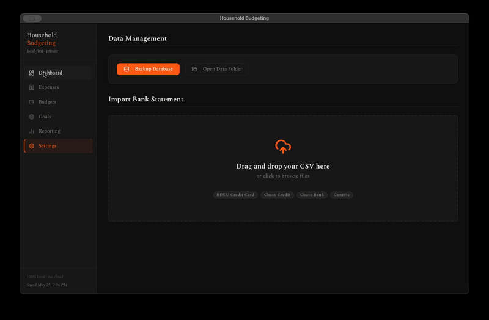

# Household Budgeting

A gorgeous, local-first, private-by-design desktop budgeting application.



This application replaces an older R/Shiny monolith with a modern, high-performance architecture: **FastAPI (Python)** on the backend and **Vite + React (TypeScript)** on the frontend. The entire application runs locally on your machine, utilizing **SQLite** for ultra-fast, offline-capable database persistence. Your financial data stays 100% private—there is no cloud tracking, telemetry, or external database setups.

---

## Features and Architecture

The application is structured around a high-fidelity user interface and a robust local API server, featuring:

*   **Interactive Dashboard:** A premium high-level financial overview showcasing your current month's total spending vs. monthly income via a beautiful visual arc, live budget health metrics, recent transactions list, and visual goal progress indicators.
*   **Ledger and Expense Management:** A full-featured transactional interface supporting instant client-side search, multi-column sorting, and pagination. Includes category/subcategory comboboxes, payer attribution (e.g., Caleb, Rae, Joint), and dedicated toggles to link expenses directly to saving goals.
*   **Dynamic Budgets Planner:** A robust calendar-aware budget organizer. Set monthly limits per category and subcategory with customizable effective/conclusion dates. Features **Weighted Moving Average (WMA)** recommendations using historical spend patterns with "Hasty" (0.6/0.3/0.1) and "Conservative" (0.4/0.4/0.2) suggestion models.
*   **Goal Milestones:** Rich visual tracking cards for active and completed savings goals. Links directly to expense items, calculates dynamic completion progress, and supports granular budget-line matching rules.
*   **Advanced Analytics and Reporting:** Full spending reports including period filters, interactive trend line/bar charts powered by **Recharts**, category breakdown visualizations, and highlighted budget overage tables sorted by worst-performing categories first.
*   **Local Data and Statement Importer:** Interactive bank CSV statement ingestion workspace supporting **BECU Credit Card, Chase Credit Card, Chase Bank, and Generic** formats. Includes live duplicate transaction detection, bulk categorization, customizable column mapping, and absolute data safety through offline database backup triggers.

---

## Design System and Aesthetics

Designed with a premium, state-of-the-art aesthetic that makes managing personal finance an engaging, tactile experience:

| Token | CSS Variable | Color Code | Description |
| :--- | :--- | :--- | :--- |
| **Background** | `--color-bg` | `#0F0F0F` | Deep dark mode background |
| **Surface** | `--color-surface` | `#1A1A1A` | Sleek cards, sidebars, and overlays |
| **Surface Raised**| `--color-surface-raised` | `#222222` | Raised button elements and active item fills |
| **Border** | `--color-border` | `#2A2A2A` | Sharp, dark interface borders |
| **Accent** | `--color-accent` | `#FF6719` | High-vibrancy Substack Orange |
| **Accent Dim** | `--color-accent-dim` | `#CC5214` | Accent color hover state |
| **Text** | `--color-text` | `#F0EDE8` | Warm off-white for reading comfort |
| **Text Muted** | `--color-text-muted` | `#8A867F` | Subtle descriptors and secondary info |
| **Danger** | `--color-danger` | `#E05252` | Budget overages, deletes, and errors |
| **Success** | `--color-success` | `#4CAF79` | Positive cash flows, goals met, and saved states |

*   **Typography:** Elegant typography using the premium serif font **Spectral** from Google Fonts (weights 200–800, normal and italic).
*   **Interactivity:** Smooth micro-animations on cards (scale transforms + custom box shadows), slide-in overlays, fade-in route transitions, and responsive toast notifications.

---

## Project Structure

```
budgeting_tool/
├── backend/                  # FastAPI Python backend
│   ├── main.py               # Main API Router & CORS configurations
│   ├── database.py           # SQLite direct interface & initial schema
│   ├── migrate.py            # Historical CSV migration script
│   ├── requirements.txt      # Backend Python dependencies
│   └── routers/              # Modular API endpoints (expenses, budgets, reporting, etc.)
├── web/                      # React / TypeScript frontend
│   ├── src/
│   │   ├── api/              # Strongly-typed fetch interfaces & client helpers
│   │   ├── components/ui/    # Custom primitive component library (Buttons, Modals, Badges)
│   │   ├── hooks/            # Custom React Query state hooks
│   │   ├── layouts/          # Persisted App Layout & navigation sidebar
│   │   ├── pages/            # View pages (Dashboard, Expenses, Budgets, Goals, etc.)
│   │   ├── styles/           # Global resets and Spectral design system configurations
│   │   └── App.tsx           # Application routing configuration
│   ├── index.html            # Web entrypoint
│   └── package.json          # Node dependencies & scripts
├── scripts/                  # Premium macOS application build pipeline
│   ├── generate_vector_icon.py  # Supersampled Pillow PNG generator
│   └── build_mac_app.py      # Retina macOS Bundle (.app) compiler
├── data/                     # Data persistence layer
│   └── budget.db             # Local SQLite database (replaces older CSV files)
├── backups/                  # SQLite backup target directory
├── desktop_app.py            # Cross-platform pywebview standalone wrapper
└── README.md                 # Project documentation
```

---

## Step-by-Step Installation on macOS

Follow these instructions to set up the application environment on your Mac from scratch.

### Prerequisites

You must have **Python 3** and **Node.js** installed on your system. You can verify this by opening Terminal and running:
```bash
python3 --version
node --version
```
If you do not have these installed, you can obtain them via:
*   **Homebrew:** Run `brew install python node` in your Terminal.
*   **Direct Installers:** Download them from [python.org](https://www.python.org/) and [nodejs.org](https://nodejs.org/).

### Installation

1.  **Clone or Open the Repository:**
    Open your Terminal and navigate to the project directory:
    ```bash
    cd /path/to/budgeting_tool
    ```

2.  **Set Up the Python Virtual Environment:**
    Create a local virtual environment named `.venv` to isolate the project dependencies:
    ```bash
    python3 -m venv .venv
    ```

3.  **Activate the Virtual Environment:**
    Activate the environment (you should see `(.venv)` prepended to your Terminal prompt):
    ```bash
    source .venv/bin/activate
    ```

4.  **Install Python Dependencies:**
    Install FastAPI, pywebview, and other required server modules:
    ```bash
    pip install -r backend/requirements.txt
    ```

5.  **Install Frontend Node Packages:**
    Navigate to the `web/` folder, download React dependencies, and return to the root folder:
    ```bash
    cd web
    npm install
    cd ..
    ```

---

## Step-by-Step Usage Instructions

Once installed, there are three distinct ways to run and interact with the application on macOS.

### Option 1: Native macOS Application Bundle (Recommended)

You can compile the project into a native macOS desktop application (`Household Budgeting.app`) and deploy it to your macOS Desktop for a seamless double-click launch.

1.  **Compile the Web Client:**
    Ensure your virtual environment is active, then build the static React frontend bundle:
    ```bash
    source .venv/bin/activate
    cd web
    npm run build
    cd ..
    ```

2.  **Install Pillow (App Icon Dependency):**
    Install the Pillow library so the icon compiler can generate custom assets:
    ```bash
    pip install pillow
    ```

3.  **Generate the Vector Icon and Build the Bundle:**
    Run the custom macOS packaging pipeline:
    ```bash
    python3 scripts/generate_vector_icon.py
    python3 scripts/build_mac_app.py
    ```

4.  **Launch the App:**
    Go to your macOS Desktop and double-click the new **Household Budgeting** icon. It will open in a native window with the custom logo showing in your Dock!

### Option 2: Standalone Desktop Window (Terminal Launch)

If you prefer to run the standalone window directly from your terminal session:

1.  **Build the Web Client (if not already done):**
    ```bash
    source .venv/bin/activate
    cd web
    npm run build
    cd ..
    ```

2.  **Start the Desktop Application Wrapper:**
    ```bash
    python3 desktop_app.py
    ```
    This script will dynamically bind to an available port, launch the FastAPI server in a background thread, and present the interface in a secure native `pywebview` window.

### Option 3: Developer Hot-Reloading Mode (Browser Launch)

Ideal if you are debugging the backend or customizing the user interface styles in real-time.

1.  **Start the Backend API Server:**
    In your first Terminal window, run:
    ```bash
    source .venv/bin/activate
    cd backend
    uvicorn main:app --reload --port 8000
    ```

2.  **Start the Frontend Vite Server:**
    In a **new** Terminal window, run:
    ```bash
    cd web
    npm run dev
    ```

3.  **Access the App:**
    Open your web browser and navigate to [http://localhost:5173](http://localhost:5173).

---

## Historical Data Migration

If you are transitioning from the older R/Shiny version of the application, seed the SQLite database with your historical CSV sheets:

1.  Ensure your old CSV documents (`expenses.csv`, `category_budget.csv`, `income_sources.csv`, `goals.csv`, and `goal_budget_links.csv`) are placed in the `data/` directory.
2.  Run the migration pipeline from the project root:
    ```bash
    source .venv/bin/activate
    python3 backend/migrate.py
    ```
3.  This script compiles, deduplicates, and populates the tables in `data/budget.db` seamlessly.


